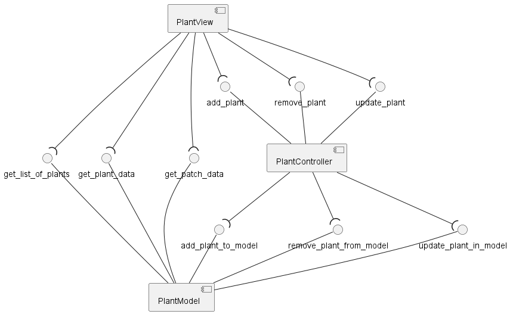
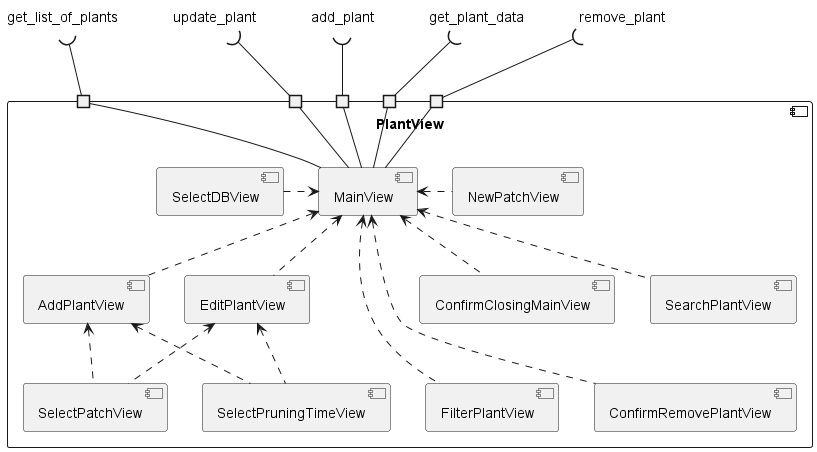

= PlantDB
Author: Alexander Heuchert
:toc: 
:toc-title: Inhaltsverzeichnis
:toclevels: 3

== Beschreibung

PlantDB ist eine Datenbank für Pflanzen im Garten, die es ermöglicht alle Informationen über alle Pflanzen im Garten abzurufen. Die Datenbank soll Daten wie Name, Rückschnittzeit, Pflegehinweise usw. beinhalten. 

Die Daten können in einer View angezeigt und verwaltet werden. 

== Anforderungen 

- Alle Pflanzen sollen folgende Attribute mit den folgenden eigenschaften besitzen:
|=====
|*Attribut*|*Beschreibung*|*Variablenname*|*Datentyp*|*Auswahlmöglichkeiten für Listen*
|Name|Name der Pflanze|name|string|

|Lateinischer Name|Lateinischer Name der Pflanze|lat_name|string|

|Pflanzen Art |Art der Pflanze. z.B. Baum, Strauch, Bodendecker ...|plant_type|string|

|Wasserverbrauch|Wasserverbrauch der Pflanze|waterconsumption|string|

|Bevorzugter Standort|Bevorzugter Standort der Pflanze|prefered_location|string|

|Pflanzort|Beete in dem die Pflanze gepflanzt sind|location|list|Beetkennung. Werden im tool angelegt.

|Zeitpunkt für Rückschnitt|Zeitpunkt/-raum in dem die Pflanze zurückgeschnitten werden muss oder kann|pruning_time|list| Jan, Feb, Mrz, Apr, Mai, Jun, Jul, Aug, Sep, Okt, Nov, Dez

|Rückschnittbeschreibung|Beschreibung der Art und des Verfahrens für den Rückschnitt|pruning_type|string|

|Giftig für Katzen| Ist die Pflanze giftig für Katzen?|toxic_cat|boolean|

|Giftig für Menschen|Ist die Pflanze giftig für Menschen?|toxic_human|boolean|

|Bemerkung|Frei wählbare Beschreibung um weitere Informationen anzugeben|comment|string|
|=====

- Die Daten sollen in einem geeigneten Format abgespeichert werden. (z.B. als json file oder in SQL)

- Der Austausch der Datenspeicherstruktur soll nicht zu Änderungen im Controller oder der View führen.  

- Die Daten sollen über eine View einsehbar sein. 

- Die Daten sollen nach folgenden Parametern gefiltert werden können: 
 * Pflanzen Art
 * Wasserverbrauch
 * Bevorzugter Standort
 * Pflanzort
 * Zeitpunkt für Rückschnitt
 * Giftig für Katzen
 * Giftig für Menschen

- Es sollen neue Pflanzen hinzugefügt werden können

- Pflanzen sollen entfernt werden können

- Beim Löschen von pflanzen soll eine Zusätzliche Frage erscheinen, ob man die Pflanze wirklich löschen will

- Jede View soll, ohne Änderungen zu übernehmen und Daten zu speichern, schließbar sein. 

- Die Daten zwischen der Datenbank und der MainView sollen konsistent sein. 

- [Optional] Ein Export in Excel bzw. csv Format 
== Component View

=== Whitebox View PlantView

=== Whitebox View PlantModel

=== Blackbox View

